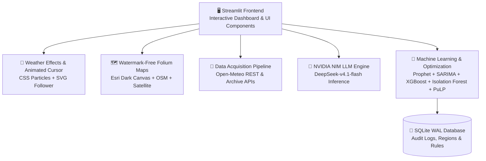

# 🌦️ ClimaTrend — Weather Analysis & Forecasting Dashboard

<div align="center">


**A full-stack weather intelligence platform built with Python & Streamlit**

[](https://python.org)
[](https://streamlit.io)

</div>

---

## 🧠 What is ClimaTrend?

**ClimaTrend** is a premium, open-source weather analytics dashboard that combines **real-time meteorological data**, **ML-powered time-series forecasting**, **interactive maps**, and **AI-generated insights** — all in one beautiful, multilingual interface.

Whether you're tracking your city's climate trends, exploring global weather patterns, or running predictive models, ClimaTrend delivers a professional-grade experience right in your browser.

---

## ✨ Features

### 📡 Real-Time Weather
- Live current conditions — temperature, humidity, wind speed, pressure, precipitation, UV index
- Hourly 48-hour forecast strip with day/night detection
- 7-day daily forecast cards with max/min temps and precipitation probability
- Dynamic 3D animated weather model (Three.js) showing clouds / moon based on current conditions

### 🗺️ Interactive Maps
- **Windy.com** embedded live weather maps centered on the selected city
- Switchable overlays: **Temperature**, **Rain/Radar**, **Wind**, **Clouds**, **Pressure**
- Adjustable zoom level (3–12)
- Location marker toggle
- Global weather distribution maps (Folium heatmap, choropleth, contour gradient)

### 📊 Historical Analysis (1-Year Data)
- Hourly → Daily aggregated pipeline with feature engineering
- Monthly violin plots, calendar heatmaps, wind rose charts
- Correlation heatmap across all weather variables
- Precipitation and wind bar averages

### 🤖 ML Forecasting Engine
Runs multiple models in parallel for any chosen weather variable:
| Model | Type |
|---|---|
| **Prophet** | Additive seasonality (trend + Fourier) |
| **SARIMA** | Classical statistical auto-selection |
| **Random Forest Regressor** | Recursive lag-based ML |
| **Linear Regression** | Baseline lag-based ML |

- 95% confidence interval bands
- Side-by-side model comparison with MAE, RMSE, MAPE metrics
- Seasonal decomposition (trend / seasonal / residual)
- ACF & PACF analysis

### 🌐 Multilingual Support (6 Languages)
| Language | Code |
|---|---|
| English | `en` |
| 日本語 (Japanese) | `ja` |
| 中文 Mandarin | `zh` |
| Español | `es` |
| Français | `fr` |
| हिन्दी (Hindi) | `hi` |

### 🤖 AI Climate Insights
- Powered by **DeepSeek-v4.1-flash** via **NVIDIA NIM** (`https://integrate.api.nvidia.com/v1`)
- Generates natural-language meteorological and climate analysis reports in 6 languages
- Integrates historical stats, 72-hour and 7-day outlooks, model diagnostics, and urban planning guidance
- Intelligent 20s timeout and automatic rule-based fallback generation ensure continuous zero-downtime operation

### 🎨 Dynamic Weather Designing Effects & Animated Smiley Cursor
- **Atmospheric Visuals**: Dynamically renders real-time ambient weather animations matched to the active location:
  - 🌧️ **Rain & Drizzle**: Translucent cascading rain streaks with subtle floor ripples
  - ⛈️ **Thunderstorms**: Heavy rain streaks with ambient electric lightning pulses
  - ❄️ **Snow & Frost**: Gentle swaying, rotating snowflake particles drifting downwards
  - ☀️ **Sunny Skies**: Radiant warm sunbeam glow and golden lens flares
  - 🌙 **Clear Nights**: Twinkling starlight fields across the deep night sky
  - 🌫️ **Overcast & Fog**: Volumetric mist layers gently floating across the horizon
- **Animated Weather Smiley Emoji Cursor**: Custom SVG smiling weather face cursor with micro-animations:
  - Custom vector weather smiley emojis that change with local conditions (☀️, 🌧️, ❄️, ⛈️, ⛅, 🌙, ☁️)
  - Interactive smooth cursor companion with spring physics, bouncing float loops, and click reactions
  - Hover reactions (blushing and scaling) over interactive buttons and navigation tabs
  - `pointer-events: none` architecture ensuring zero interference with dashboard interactions

### 🗺️ Multi-Layer Watermark-Free Interactive Maps
- Clean, high-performance basemaps with **zero watermarks** and no third-party key requirements
- Built-in Leaflet Layer Control switcher:
  - **Dark Canvas (Default)**: Esri World Dark Gray Base tailored for ClimaTrend's dark UI theme
  - **OpenStreetMap**: Classic high-detail street map (highways, rivers, terrain, landmarks)
  - **Satellite Imagery**: High-resolution Esri World Imagery aerial photography
- Embedded **Windy.com** live radar overlays for Temperature, Wind, Radar/Precipitation, and Clouds

### 🎥 Immersive UI
- Live **video wallpaper** background served from a local HTTP server
- Glassmorphism card design with `backdrop-filter` blur
- Smooth micro-animations and hover effects
- Full dark mode with curated color palette

---

## 🛠️ Tech Stack & Architecture Overview



### Component Distribution & Tech Usage

```
Frontend & UI      [██████████████████████████████] 30% (Streamlit, Three.js, CSS Animations, SVG)
ML & Analytics     [████████████████████████      ] 24% (XGBoost, Prophet, SARIMA, SHAP, Isolation Forest)
Climate Suite      [████████████████████          ] 20% (Carbon, AQI, Risk, Reduction, Infrastructure, Disasters)
Data & APIs        [████████████                  ] 12% (Open-Meteo, USGS, NASA FIRMS, OpenAQ, Requests)
Database & Storage [████████                      ]  8% (SQLite WAL, JSON Schema, File Cache)
AI / LLM Engine    [██████                        ]  6% (NVIDIA NIM, DeepSeek-v4.1-flash, OpenAI SDK)
```

| Layer | Technology | Primary Role |
|---|---|---|
| **Frontend / App** | [Streamlit](https://streamlit.io) 1.64+ | Reactive web dashboard, sidebar navigation, widgets |
| **Visual FX & Cursor** | Modern CSS Keyframes & SVG | Ambient weather particle effects & animated weather smiley emoji cursor |
| **Maps** | [Folium](https://python-visualization.github.io/folium/), [Leaflet](https://leafletjs.com/) | Watermark-free multi-layer maps (Esri Dark Canvas, OSM, Satellite) |
| **3D Graphics** | [Three.js](https://threejs.org) | Interactive 3D celestial and weather state cards |
| **Charting** | [Plotly Express](https://plotly.com/), [Matplotlib](https://matplotlib.org/) | Time-series, correlation matrices, wind roses, radar plots |
| **Forecasting ML** | [Prophet](https://facebook.github.io/prophet/), [statsmodels](https://www.statsmodels.org/) | Additive seasonality decomposition & SARIMAX forecasting |
| **Environmental ML** | [XGBoost](https://xgboost.readthedocs.io/), [scikit-learn](https://scikit-learn.org/) | 72h AQI regression, hazard anomaly classification |
| **Explainable AI** | [TreeSHAP](https://shap.readthedocs.io/) | SHAP feature attribution for carbon and risk anomalies |
| **Optimization** | [PuLP](https://coin-or.github.io/pulp/) (ILP) | Knapsack integer linear programming for carbon reduction |
| **Database** | SQLite3 (WAL Mode) | Persistent asset tracking, alert logs, subscriptions, and rules |
| **AI Insights** | [NVIDIA NIM](https://integrate.api.nvidia.com/) | DeepSeek-v4.1-flash natural language intelligence reports |
| **External APIs** | Open-Meteo, USGS, NASA FIRMS | Real-time weather, seismic tremors, thermal fire anomalies |

## 📁 Project Structure

```
Weather_Data-Analysis-and-Prediction/
├── run.bat                   # 🚀 Multi-command Windows launcher (app, test, scheduler, backtest, db)
├── requirements.txt          # 📦 Python project dependencies
├── pytest.ini                # 🧪 Pytest configuration
├── .env.example              # 🔑 API key template (safe to commit)
├── .gitignore
├── docs/
│   ├── climate_modules.md    # 📖 Full climate suite specifications and equations
│   └── backtest_reports/     # 📈 10-year ERA5 historical alert validation reports
├── tests/                    # 🧪 36 automated unit & integration test suites
│   ├── test_air_quality.py
│   ├── test_alerts_engine.py
│   ├── test_carbon.py
│   ├── test_clients.py
│   ├── test_db.py
│   ├── test_disasters.py
│   ├── test_history_rules_and_backtest.py
│   ├── test_infrastructure.py
│   ├── test_reduction_optimizer.py
│   ├── test_regional_climatology.py
│   ├── test_risk.py
│   └── test_weather_effects.py
└── climatrend/
    ├── app.py                # 🏠 Main Streamlit application
    ├── logo.jpg
    ├── data/
    │   └── climate.db        # 💾 SQLite WAL database (assets, logs, rules, cache)
    ├── src/                  # ⛅ Core Weather & Analytics Pipeline
    │   ├── ai_insights.py        # 🤖 NVIDIA NIM DeepSeek v4.1 report generator
    │   ├── weather_effects.py    # 🎨 Ambient atmospheric effects & animated smiley cursor
    │   ├── chart_visualizations.py  # 📊 Plotly + Matplotlib visualizations
    │   ├── data_acquisition.py   # 📡 Open-Meteo REST & archive API client
    │   ├── data_cleaning.py      # 🧹 Feature engineering pipeline
    │   ├── eda.py                # 📈 Seasonal decomposition, ACF/PACF
    │   ├── forecasting_model.py  # 🔮 Prophet, SARIMA, lag ML regressors
    │   ├── map_visualizations.py # 🗺️ Folium heatmap & multi-layer maps
    │   ├── threejs_models.py     # 🌩️ 3D animated celestial weather card
    │   └── translations.py       # 🌐 6-language internationalization
    └── climate/              # 🌍 Climate & Environmental Intelligence Suite
        ├── air_quality/      # 🍃 EPA AQI & 72h XGBoost forecaster
        ├── alerts/           # 🚨 Shared multi-channel alert engine & delivery
        ├── carbon/           # 👣 Scope 1-3 tracking, Isolation Forest & SHAP
        ├── clients/          # 📡 External clients (USGS, NASA FIRMS, OpenAQ)
        ├── db/               # 💾 SQLite schema, migration & connection pooling
        ├── disasters/        # 🌊 Seismic, fire, and flood early warnings
        ├── infrastructure/   # 🏗️ Asset elevation analysis & resilience planning
        ├── reduction/        # 💡 PuLP ILP knapsack decarbonization optimizer
        ├── regional_alerts/  # 🏛️ ERA5 percentiles, GEV return periods, backtest
        ├── risk/             # ⚠️ IPCC AR6 multi-hazard risk engine
        └── ui/               # 🎨 Modular Streamlit views & watermark-free map helper
```

---

## 📸 Screenshots

### 🌡️ Real-Time Current Weather Conditions

> Live temperature, humidity, wind speed, pressure & the interactive 3D animated weather model (daytime sun shown above London at 25.9°C).

---

### 🌐 Interactive 3D Weather State Space

> A fully interactive 3D scatter plot visualizing temperature, humidity, wind speed & precipitation together — powered by Plotly.

---

### 🗺️ Interactive Maps — Temperature Overlay (日本語 UI)

> Live Windy.com map centred on Tokyo with the **Temperature** overlay active, demonstrating the full multilingual Japanese interface.

---

### ☁️ Interactive Maps — Cloud Cover Overlay (日本語 UI)

> Same map view switching to the **Clouds** overlay — showcasing switchable weather layers and the seamless language localisation.

---

## ⚙️ Configuration

| Setting | Where to change |
|---|---|
| API Key (NVIDIA/DeepSeek) | `.env` → `NVIDIA_API_KEY` |
| Wallpaper video path | `app.py` → `start_background_wallpaper_server()` → `directory` |
| Default city list | `app.py` → `PREDEFINED_CITIES` dict |
| Forecast horizon | Sidebar slider in the **Trends** tab |
| Temperature unit (°C/°F) | Sidebar toggle |

---

## 🧮 Forecasting Methods

### Prophet (Additive Seasonality)
$$y(t) = g(t) + s(t) + h(t) + \epsilon_t$$
where $g(t)$ = trend, $s(t)$ = seasonality, $h(t)$ = holidays, $\epsilon_t$ = error.

### SARIMAX
$$(p, d, q) \times (P, D, Q)_m$$
Stepwise auto-selection of AR, differencing, and MA components with seasonal period $m$.

### Recursive Lag ML
Transforms forecasting into tabular regression using lag features at $1, 2, 7, 30, 365$ days plus rolling statistics — fitted with Random Forest or Linear Regression.

---

## 🌍 Climate & Environmental Intelligence Suite

ClimaTrend now includes a comprehensive suite of 7 climate intelligence features:

1. **👣 Carbon-Footprint Tracking & Emission Analytics**: Log travel, energy, food, and waste activities with DEFRA/EPA factors. Detects consumption anomalies with **Isolation Forest** and explains drivers using **TreeSHAP**.
2. **🍃 Air Pollution & Environmental Monitoring**: Live Open-Meteo & OpenAQ criteria pollutants ($PM_{2.5}, PM_{10}, NO_2, O_3, CO, SO_2$), EPA AQI classifications, health guidance, and **XGBoost** AQI forecasting.
3. **⚠️ Climate-Risk & Extreme-Weather Prediction**: Multi-hazard risk scoring ($Hazard \times Exposure \times Vulnerability$) for heatwaves, river flooding, gales, and agricultural drought with interactive radar plots.
4. **💡 Greenhouse-Gas Emission Reduction Recommendations**: Knapsack Integer Linear Programming (**PuLP**) optimizing capital budgets and implementation effort to maximize annual $CO_2e$ avoided.
5. **🏗️ Climate-Resilient Infrastructure Planning**: Critical asset mapping (hospitals, power substations, water treatment) with elevation-based flood/heat vulnerability scoring and prioritized engineering adaptations.
6. **🚨 Disaster Early-Warning System**: Real-time alerts for USGS earthquakes, NASA FIRMS active fires, and flood conditions with distance radius filtering.
7. **🏛️ Historical-Weather-Based Regional Alert System**: 25-year ERA5 Day-of-Year climatology percentiles ($p_{95}, p_{99}$), GEV return periods, Mann-Kendall trend tests, ML anomaly classification, and a 10-year historical backtest engine.

*All alerts share a single unified `SharedAlertEngine` with 12h cooldowns, escalation logic, and multi-channel delivery (In-App, ntfy, Telegram, Email).* Detailed docs available in [`docs/climate_modules.md`](docs/climate_modules.md).

---

## 🚀 Quick Start & Operations (`run.bat`)

ClimaTrend includes a production-ready Windows automation launcher script ([`run.bat`](run.bat)) providing one-click environment bootstrap, testing, background schedulers, and diagnostics:

```bat
# 1. Launch the complete ClimaTrend Streamlit Web App (default: http://localhost:8501)
run.bat

# Forward custom Streamlit flags:
run.bat --server.port 8502 --server.headless true

# 2. Run the complete automated test suite (36 tests across all modules)
run.bat test

# 3. Start the background real-time disaster & alert polling daemon (APScheduler)
run.bat scheduler

# 4. Run the 10-year historical ERA5 hazard alert backtest & calibration engine
run.bat backtest

# 5. Initialize or verify SQLite database tables & seed initial regions and rules
run.bat init-db

# 6. Run system health check (validates core ML packages, .env, and DB connectivity)
run.bat check

# 7. Clean Python bytecode (__pycache__) and pytest cache
run.bat clean

# 8. Install or update dependencies from requirements.txt
run.bat install

# 9. View help & CLI command reference
run.bat help
```

---

## 🤝 Contributing

Pull requests are welcome! For major changes, please open an issue first to discuss what you'd like to change.

1. Fork the repo
2. Create your feature branch (`git checkout -b feature/amazing-feature`)
3. Commit your changes (`git commit -m 'Add amazing feature'`)
4. Push to the branch (`git push origin feature/amazing-feature`)
5. Open a Pull Request

---

## 📜 License

This project was built and is maintained by **Abhigyan**. Feel free to use it for learning and personal projects. Give credit if you build on top of it! 🙌

---

## 🙏 Acknowledgements

- [Open-Meteo](https://open-meteo.com/) — free, open-source weather API
- [Windy.com](https://www.windy.com/) — beautiful live weather maps
- [Three.js](https://threejs.org/) — 3D graphics in the browser
- [Facebook Prophet](https://facebook.github.io/prophet/) — time-series forecasting
- [NVIDIA NIM](https://integrate.api.nvidia.com/) — AI inference API
- [DeepSeek](https://www.deepseek.com/) — the underlying language model

---

<div align="center">
Made with ❤️ by <a href="https://github.com/abhigyanTakt">Abhigyan</a>
</div>
