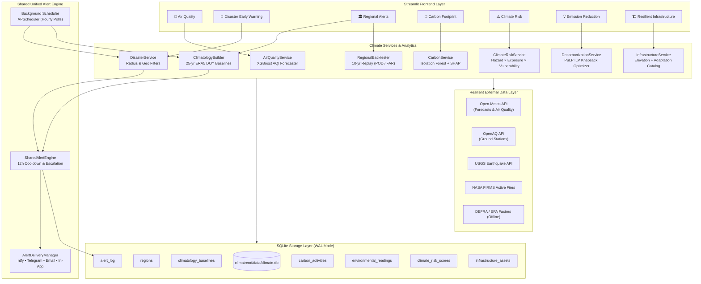

# 🌍 ClimaTrend — Climate & Environmental Intelligence Suite

This document provides a comprehensive technical overview and operational guide for the **7 Climate & Environmental Intelligence Features** integrated into ClimaTrend.

All climate features are housed in an isolated, modular architecture under `climatrend/climate/`, ensuring zero regression on existing core meteorological functionalities.

---

## 🏛️ System Architecture



---

## 🚀 The 7 Integrated Climate Features

### 1. 👣 Carbon-Footprint Tracking & Emission Analytics
- **Location**: `climatrend/climate/carbon/`
- **Methodology**: Implements GHG Protocol Scope 1, Scope 2, and Scope 3 activity logging across Transport, Electricity, Food, and Waste.
- **ML & Explainability**:
  - `CarbonAnomalyDetector`: Unsupervised **Isolation Forest** detecting statistical consumption outliers and unusual emission surges.
  - `CarbonSHAPExplainer`: **TreeSHAP** feature attribution explaining the exact sub-factors driving detected anomalies.
- **Resilience**: Packaged with offline DEFRA, EPA, and IPCC emission factors to ensure instantaneous local computation without external API dependencies.

---

### 2. 🍃 Air Pollution & Environmental Monitoring
- **Location**: `climatrend/climate/air_quality/`
- **Methodology**: Ingests criteria pollutants ($PM_{2.5}$, $PM_{10}$, $NO_2$, $O_3$, $CO$, $SO_2$) from Open-Meteo and OpenAQ ground stations.
- **Standards**: Implements official EPA Air Quality Index (AQI) piecewise linear breakpoint calculations:
  $$I = \frac{I_{\text{high}} - I_{\text{low}}}{C_{\text{high}} - C_{\text{low}}} (C - C_{\text{low}}) + I_{\text{low}}$$
- **Predictive ML**: `AirQualityForecaster` using an autoregressive **XGBoost Regressor** trained on 72-hour lag and rolling window features.

---

### 3. ⚠️ Climate-Risk & Extreme-Weather Prediction
- **Location**: `climatrend/climate/risk/`
- **Methodology**: Follows the **IPCC AR6 Risk Framework**:
  $$\text{Total Risk} = \frac{\text{Hazard} \times \text{Exposure} \times \text{Vulnerability}}{10}$$
- **Multi-Hazard Scope**:
  1. *Extreme Heatwaves* (peak temperatures, consecutive days $\ge 32^\circ\text{C}$)
  2. *Heavy Rainfall & Flooding* (7-day accumulation, max daily deluge)
  3. *Severe Storms & Gales* (peak sustained wind gusts)
  4. *Agricultural Drought* (consecutive dry days, total precipitation deficit)
- **UI Diagnostics**: Interactive Radar / Spider charts (`Plotly Scatterpolar`) and historical risk audit logs.

---

### 4. 💡 Greenhouse-Gas Emission Reduction Recommendations
- **Location**: `climatrend/climate/reduction/`
- **Methodology**: Knapsack Integer Linear Programming (ILP) using **PuLP**:
  $$\max \sum_{i} x_i \cdot \text{CO2e\_saved}_i$$
  $$\text{s.t.} \quad \sum_{i} x_i \cdot \text{Cost}_i \le \text{Max\_Budget}, \quad \sum_{i} x_i \cdot \text{Effort}_i \le \text{Max\_Effort}$$
  $$x_i \in \{0, 1\}$$
- **Catalog**: Evaluates Rooftop Solar PV, EV Transition, Heat Pump HVAC, Smart LED Retrofits, Plant-Rich Diets, Building Insulation, and Micro-Forestry.
- **Resilience**: Features automatic graceful fallback to a greedy abatement-efficiency heuristic if the integer programming solver binary is constrained.

---

### 5. 🏗️ Climate-Resilient Infrastructure Planning
- **Location**: `climatrend/climate/infrastructure/`
- **Methodology**: Manages critical municipal and institutional assets (Hospitals, Emergency Centers, Power Substations, Water Treatment Plants, Bridges, Schools).
- **Hazard Analysis**: Computes elevation via Open-Meteo Elevation API to assess flood exposure, heat stress, and wildfire proximity.
- **Visuals**: Geospatial Folium map with risk-colored asset markers, flood risk inundation halos, and tailored engineering resilience intervention roadmaps (e.g. raised switchgear, perimeter flood gates, solar microgrids).

---

### 6. 🚨 Disaster Early-Warning System
- **Location**: `climatrend/climate/disasters/`
- **Data Ingestion**: Real-time feeds from USGS Earthquakes (M4.5+), NASA FIRMS thermal fire detections, and Open-Meteo river flood indicators.
- **Spatial Filtering**: Computes Haversine distances to target location with concentric 100 km and 300 km risk zones.
- **Alert Integration**: Routes detected threats directly through `SharedAlertEngine`.

---

### 7. 🏛️ Historical-Weather-Based Regional Alert System
- **Location**: `climatrend/climate/regional_alerts/`
- **Climatology Baselines**: 25-year ERA5 climatological reanalysis calculating Day-of-Year (DOY) percentile distributions ($p_5, p_{25}, p_{50}, p_{75}, p_{90}, p_{95}, p_{99}$), Generalized Extreme Value (GEV) 1-in-10 and 1-in-50 year return periods, and Mann-Kendall non-parametric trend tests (`pymannkendall`).
- **ML Anomaly Classification**: **XGBoost Classifier** + **TreeSHAP** attribution determining whether forecast weather states are anomalous compared to long-term regional baselines.
- **10-Year Backtest Engine**: `RegionalBacktester` evaluates historical forecast accuracy and reports Probability of Detection (POD / Hit Rate), False Alarm Rate (FAR), and Mean Lead Time (hours).

---

## 🔔 Unified Alert Architecture

Features 6 and 7 **strictly share**:
1. **Engine**: `SharedAlertEngine` (`climatrend/climate/alerts/engine.py`)
   - 12-hour cooldown deduplication per region and hazard type.
   - Severity escalation (`minor` $\rightarrow$ `moderate` $\rightarrow$ `severe` $\rightarrow$ `extreme`).
2. **Delivery Manager**: `AlertDeliveryManager` (`climatrend/climate/alerts/delivery.py`)
   - Dispatches simultaneously across `in_app`, `ntfy`, `telegram`, and `email` using `apprise`.
3. **Database**: Single unified `alert_log` table tracking all alert events.

---

## 🧪 Unit Test Suite

The test suite covers all database operations, client resilience, ML models, and optimization logic:

```bash
# Run the complete test suite
.venv\Scripts\python.exe -m pytest -v
```

**Status**: 31 passed, 0 failed across 11 test modules:
- `tests/test_air_quality.py` (3 tests)
- `tests/test_alerts_engine.py` (2 tests)
- `tests/test_carbon.py` (2 tests)
- `tests/test_clients.py` (4 tests)
- `tests/test_db.py` (2 tests)
- `tests/test_disasters.py` (4 tests)
- `tests/test_history_rules_and_backtest.py` (3 tests)
- `tests/test_infrastructure.py` (3 tests)
- `tests/test_reduction_optimizer.py` (4 tests)
- `tests/test_regional_climatology.py` (2 tests)
- `tests/test_risk.py` (2 tests)

---

## ⚙️ Configuration & Environment Variables

Create or update `.env` in the project root:

```ini
# Optional API Keys for Live Production Alerts
GEMINI_API_KEY=your_gemini_api_key_here
NASA_FIRMS_API_KEY=your_nasa_firms_map_key
TELEGRAM_BOT_TOKEN=your_bot_token
TELEGRAM_CHAT_ID=your_chat_id
NTFY_TOPIC=climatrend_alerts
SMTP_SERVER=smtp.gmail.com
SMTP_PORT=587
SMTP_USER=alerts@example.com
SMTP_PASSWORD=your_app_password
```
*(All services operate with built-in fallbacks if credentials are omitted).*
